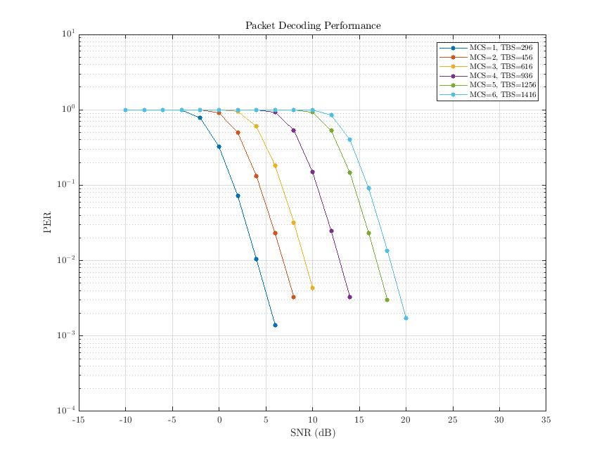
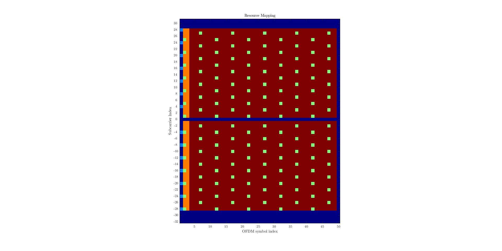

# DECT-2020 New Radio Link-Level Simulation Environment
This program contains a Matlab link-level simulation environment for the ETSI standard DECT-2020 New Radio (NR) (ETSI TS 103 636-1), also marketed as DECT NR+.

[DECT Introduction](https://www.etsi.org/technologies/dect)

The standard consists of multiple parts which can be found on the DECT Technical Committee (TC) webpage.

[DECT committee page](https://www.etsi.org/committee/1394-dect)

## Capabilities
The complete physical layer of a DECT-2020 NR transmitter is implemented. This includes all bandwidths, MIMO modes, channel coding etc. Additionally, BERs and PERs can be simulated in different wireless channel models, in particular doubly-selective channels. For the receiver, STO and CFO synchronization as well as most MIMO modes have been implemented.

## ToDo
- [ ] incorporate latest changes from 2024-03
- [ ] adapt synchronization parameters to new STF cover sequence
- [ ] implement basic MIMO algorithms for NSS > 1
- [ ] add phase error gradient correction due to SCO

## Main Scripts
- **main_single_packet.m**: Simple example demonstrating how to use the simulation environment. Creates a DECT-2020 NR packet, sends it through a wireless channel and decodes it.
- **main_BER_PER_over_MCS.m**: Parallel simulation of bit and packet error rates over MCS.
- **main_BER_PER_over_MCS_plot_PCC.m**: Plot results of **main_BER_PER_over_MCS.m** for PCC.
- **main_BER_PER_over_MCS_plot_PDC.m**: Plot results of **main_BER_PER_over_MCS.m** for PDC.

## Requirements
The Matlab LTE Toolbox is required for channel coding, the Parallel Computing Toolbox for reducing simulation time and the Communications Toolbox for wireless channel simulation.

## Exemplary Results

### Packet Error Rates (PERs)
PERs of a SIMO (two receive antennas) system for different MCS over SNR in a Rician fading channel.

  

### Resource Mapping
Resource mapping of STF, DRS, PCC and PDC in the time-frequency lattice.

  

### Channel Interpolation
Interpolated average path gains for a doubly selective channel.

  

