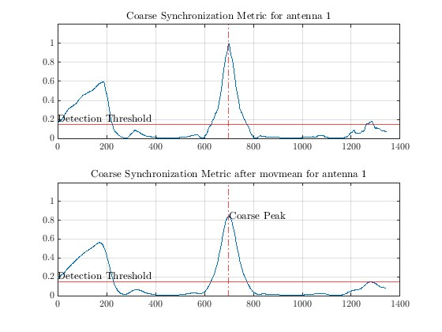
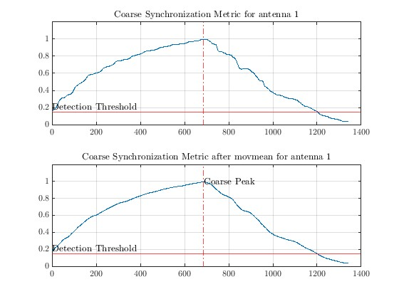
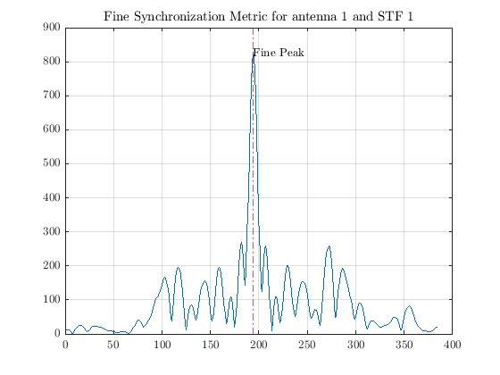

# DECT-2020 New Radio Link-Level Simulation Environment
This program contains a Matlab link-level simulation environment for the ETSI standard DECT-2020 New Radio (NR) (ETSI TS 103 636-1), also marketed as DECT NR+.

[DECT Introduction](https://www.etsi.org/technologies/dect)

The standard consists of multiple parts which can be found on the DECT Technical Committee (TC) webpage.

[DECT committee page](https://www.etsi.org/committee/1394-dect)

## Capabilities
The complete physical layer of a DECT-2020 NR transmitter is implemented. This includes all bandwidths, MIMO modes, channel coding etc. Additionally, BERs and PERs can be simulated in different wireless channel models, in particular doubly-selective channels. For the receiver, STO and CFO synchronization as well as most MIMO modes have been implemented.

## Requirements
The Matlab LTE Toolbox is required for channel coding, the Parallel Computing Toolbox for reducing simulation time and the Communications Toolbox for wireless channel simulation.

## Main Scripts
- **main_single_packet.m**: Simple example demonstrating how to use the simulation environment.
- **main_BER_PER_over_MCS.m**: Parallel simulation of bit and packet error rates over MCS.
- **main_BER_PER_over_MCS_plot_PCC.m**: Plot results of **main_BER_PER_over_MCS.m** for PCC.
- **main_BER_PER_over_MCS_plot_PDC.m**: Plot results of **main_BER_PER_over_MCS.m** for PDC.

## ToDo
- [ ] incorporate latest changes from 2024-03
- [x] adapt synchronization parameters to new STF cover sequence
- [ ] implement basic MIMO algorithms for NSS > 1
- [ ] add phase error gradient correction due to SCO

## Exemplary Simulation Results

### Packet Error Rates (PERs)
PERs of a SIMO (two receive antennas) system for different MCS over SNR in a Rician fading channel.

  

### Resource Mapping
Resource mapping of STF, DRS, PCC and PDC in the time-frequency lattice.

  

### Channel Interpolation
Interpolated average path gains for a doubly selective channel.

  

## Implementation Details

### Synchronization

DECT NR+ packet synchronization is based on the Synchronization Training Field (STF). In this repository, synchronization is [multi-stage](https://ieeexplore.ieee.org/document/4717982). In the first stage, it consists of packet detection and a coarse peak search based on an autocorrelation of the received signal. The autocorrelation exploits that the STF consists of several regular patterns. The position of the coarse peak is also used for a correction of the fractional and integer Carrier Frequency Offset (CFO). The second stage is a fine peak search based on a cross-correlation with the STF whose shape is known to the receiver.

Alternatively, since the introduction of the cover sequence in V1.5.1, a simplified synchronization can be carried out using only cross-correlation. The advantage of multi-stage synchronization is a reduced flop count, the advantage of cross-correlation synchronization is its performance at lower SNRs.

At high SNR, the normalized coarse metric has the following shape. Note that the metric has a much smaller amplitude at low SNRs (<6dB).
Coarse Metric with Cover Sequence | Coarse Metric without Cover Sequence
:--------------------------------:|:-----------------------------------:
  |  

The fine metric has the following shape.
Fine Metric with Cover Sequence | Fine Metric without Cover Sequence
:--------------------------------:|:-----------------------------------:
  |  

Thanks to the cover sequence, only one fine peak without significant secondary peaks remains. Without the cover sequence, the already large secondary peaks can easily exceed the main peak if the CFO is large, even at high SNR. But to be able to correct the CFO beforehand, the position of the STF must be known, which requires a prior search for the coarse peak. The shape of the coarse metric is not affected by a CFO.
